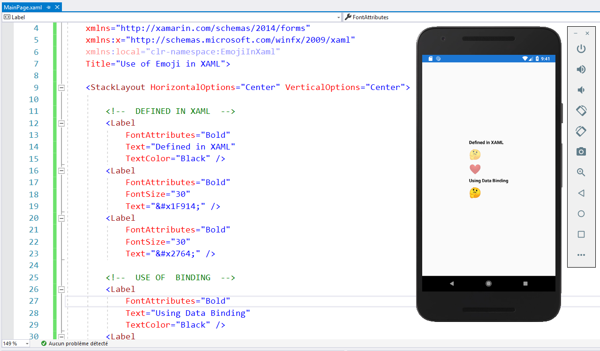

## Use of Emoji in Xamarin.Forms 🤓🤔👨 🤹‍




## How to define and use emoji in XAML only

For example , 🤔 is represented by `U+1F914`.

Since XAML  is an XML-based markup language, we have to use XML escape character `&#;` and we have to replace `U+` prefix by `x` for each part of our emoji :

`U+1F914` become `&#x1F914;` :

```xaml
<Lebel Text="&#x1F914;" />
```

## Use Binding

if you want to use Data Binding to display emoji, let’s define a class that will represent emoji:

```csharp
using System;
using System.Text;

namespace EmojiInXaml.Models
{
    /// <summary>
    /// Emoji class.
    /// </summary>
    public class Emoji
    {
        readonly int[] codes;

        public Emoji(int[] codes)
        {
            this.codes = codes;
        }

        public Emoji(int code)
        {
            codes = new int[] { code };
        }

        public override string ToString()
        {
            if (codes == null)
                return string.Empty;

            var sb = new StringBuilder(codes.Length);

            foreach (var code in codes)
                sb.Append(Char.ConvertFromUtf32(code));

            return sb.ToString();
        }
    }
}
```

It requires a single Unicode character or sequence of characters as an input and simply overrides the `ToString` . Please note that `U+` prefix should be replaced with `0x` to specify hexadecimal notation.

**Example of usage**

 // person biking => http://www.unicode.org/emoji/charts/full-emoji-list.html#1f6b4  

```csharp
string bikingEmoji = new Emoji(0x1F6B4).ToString(); // 🚴
```

```xaml
 <Label Text="{Binding bikingEmoji}" />
```

